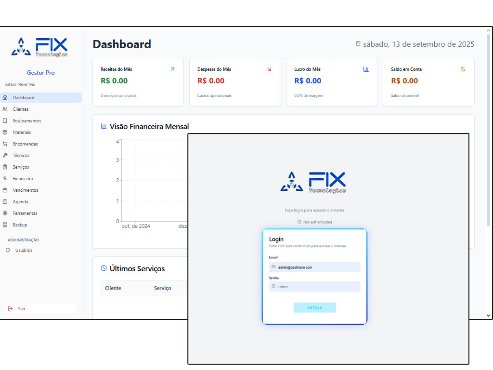

# OEM Fix Tecnologias - Management System

A comprehensive business management system built for technical service companies, featuring client management, service tracking, financial control, and technician coordination.

## 🚀 Tech Stack

### Frontend
- **React 18** - Modern React with functional components and hooks
- **TypeScript** - Type-safe development
- **Vite** - Fast build tool and development server
- **Tailwind CSS** - Utility-first CSS framework
- **shadcn/ui** - High-quality UI component library
- **React Router DOM** - Client-side routing
- **React Hook Form** - Form handling with validation
- **Zod** - Schema validation

### State Management & Data
- **React Context API** - Global state management
- **TanStack React Query** - Server state management and caching
- **Local Storage** - Client-side data persistence

### UI & UX
- **Lucide React** - Icon library
- **Recharts** - Chart and data visualization
- **React Day Picker** - Date selection
- **Sonner** - Toast notifications
- **Next Themes** - Dark/light theme support

### Business Logic
- **date-fns** - Date manipulation and formatting
- **UUID** - Unique identifier generation
- **HTML2Canvas** - Screenshot and image generation
- **jsPDF** - PDF document generation
- **XLSX** - Excel file handling
- **DocxTemplater** - Word document generation

## 🏗️ Architecture

### Project Structure
```
src/
├── components/          # Reusable UI components
│   ├── ui/             # shadcn/ui components
│   ├── dialogs/        # Modal dialogs
│   ├── reports/        # Report components
│   └── service/        # Service-specific components
├── context/            # React Context providers
├── hooks/              # Custom React hooks
├── pages/              # Route components
├── services/           # Business logic services
├── types/              # TypeScript type definitions
└── utils/              # Utility functions
```

### Key Architectural Patterns

#### 1. Context-Based State Management
- **AppContext**: Global application state for core entities
- **AuthContext**: Authentication and user session management

#### 2. Service Layer Architecture
- Centralized business logic in service classes
- Separation of concerns between UI and data operations
- Consistent API patterns across all services

#### 3. Component Composition
- Atomic design principles with reusable components
- Dialog-based workflows for complex operations
- Responsive design with mobile-first approach

#### 4. Type Safety
- Comprehensive TypeScript definitions
- Strict type checking for data integrity
- Interface contracts between components

## 🔧 Features

### Core Modules
- **Dashboard** - Business overview and key metrics
- **Client Management** - Customer database and history
- **Service Management** - Work order tracking and scheduling
- **Material Management** - Inventory and stock control
- **Technician Management** - Staff coordination and assignments
- **Financial Management** - Revenue, expenses, and cash flow
- **Equipment Management** - Asset tracking and maintenance
- **Calendar** - Appointment and task scheduling
- **Reporting** - Business intelligence and analytics

### Advanced Features
- **Multi-user Support** - Role-based access control (Admin, Technician, Client)
- **Installment Management** - Payment plans and scheduling
- **PDF Generation** - Service reports and invoices
- **Data Export** - Excel and CSV export capabilities
- **Backup System** - Data export and import functionality
- **Client Portal** - Customer-facing interface for service tracking

## 🔐 Authentication & Authorization

### User Roles
- **Admin**: Full system access and user management
- **Technician**: Service and client management
- **Client**: Read-only access to personal services

### Security Features
- JWT-based authentication simulation
- Role-based route protection
- Secure session management
- Protected API endpoints

## 💾 Data Management

### Storage Strategy
- **Local Storage**: Primary data persistence
- **Session Storage**: Temporary data and cache
- **Context API**: Runtime state management
- **React Query**: Server state caching and synchronization

### Data Models
- **Clients**: Customer information and contact details
- **Services**: Work orders with materials and labor tracking
- **Materials**: Inventory management with stock levels
- **Technicians**: Staff profiles and specializations
- **Equipment**: Asset tracking and maintenance schedules
- **Financial**: Revenue, expenses, and cash flow records

## 🎨 UI/UX Design

### Design System
- **shadcn/ui** components for consistency
- **Tailwind CSS** for responsive design
- **Lucide icons** for visual clarity
- **Consistent spacing** and typography scales


### Responsive Behavior
- Mobile-first design approach
- Adaptive layouts for different screen sizes
- Touch-friendly interface elements
- Optimized navigation for mobile devices

## 📊 Business Intelligence

### Reporting Capabilities
- **Monthly Reports**: Revenue and service summaries
- **Client Reports**: Customer service history
- **Budget Analysis**: Project cost tracking
- **DRE Reports**: Profit and loss statements
- **Cash Flow**: Financial position tracking

### Analytics Features
- Service completion rates
- Technician performance metrics
- Material usage patterns
- Revenue trend analysis
- Client satisfaction tracking

## 🔄 Development Workflow

### Getting Started
```bash
# Clone the repository
git clone <repository-url>
cd <project-directory>

# Install dependencies
npm install

# Start development server
npm run dev

# Build for production
npm run build
```

### Code Standards
- TypeScript strict mode enabled
- ESLint configuration for code quality
- Consistent naming conventions
- Component-based architecture
- Comprehensive error handling

### Testing Strategy
- Component isolation testing
- Integration testing for workflows
- User acceptance testing scenarios
- Cross-browser compatibility testing

## 🚀 Deployment

### Build Process
```bash
# Production build
npm run build

# Preview production build
npm run preview
```

### Environment Configuration
- Environment variables for API endpoints
- Configuration for different deployment stages
- Asset optimization and minification
- CDN integration support

## 📈 Performance Optimization

### Frontend Performance
- Code splitting with React.lazy
- Image optimization and lazy loading
- Bundle size optimization
- Efficient re-rendering patterns

### Data Performance
- React Query caching strategies
- Optimistic updates for better UX
- Background data synchronization
- Efficient state management

## 🛠️ Maintenance & Support

### Monitoring
- Error boundary implementation
- Performance monitoring hooks
- User interaction tracking
- System health checks

### Backup & Recovery
- Automated data export functionality
- Manual backup creation tools
- Data integrity validation
- Recovery procedures documentation

## 📝 API Documentation

### Service Methods
Each service class provides standardized methods:
- `getAll()` - Retrieve all records
- `getById(id)` - Get specific record
- `create(data)` - Create new record
- `update(id, data)` - Update existing record
- `delete(id)` - Remove record
- `search(criteria)` - Filter and search

### Data Validation
- Zod schema validation for all inputs
- Type checking at runtime
- Consistent error handling
- Sanitization of user inputs

## 🤝 Contributing

### Development Guidelines
1. Follow TypeScript best practices
2. Maintain component isolation
3. Write comprehensive type definitions
4. Implement proper error handling
5. Ensure responsive design compliance

### Code Review Process
- Type safety verification
- Performance impact assessment
- UI/UX consistency check
- Security vulnerability review

---

## 📞 Support

For technical support or questions about the system:
- Check the codebase documentation
- Review component prop definitions
- Examine service class implementations
- Test functionality in development mode

Built with ❤️ using modern web technologies for efficient business management.

## 🖼️ Application Screenshots


